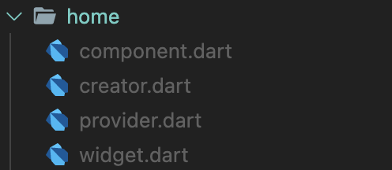

# online_provider

一个轻量级, 基于Provider的状态管理框架.

## 写在一切的开头

很多开发者可能看到本项目源码会有很亲切的感觉, 粗看以后应该就可以直接上手. 但本人在此还是要多强调一些概念, 以便各位开发者朋友查阅.

### 页面入口 OPCreator

创造器, 它对一个页面的各个模块(OPProvider, OPComponent, OPWidget)进行组装, 同时也是连接这些模块的桥梁.

Creater的本质是一个扩充后的StatefulWidget, 它被赋予了连接单页面内各个模块的能力.

### 单页面 OPWidget

一个页面的视图层实现. 它相当于StatefulWidget里的State. OPWidget继承了State的全部接口, 并在此基础上扩充了对OPComponent绑定context和creator的能力.

之所以提供让OPComponent绑定context和creator的接口, 是因为希望OPComponent能作为OPWidget的一个延伸, 专门负责构建**单页面**内复用度高的Widget.

### 单页面延伸 OPComponent

OPComponent是OPWidget的一个延伸. 其产生目的有二:

1. 为OPWidget提供稍微复杂的Widget构建方法
2. 为OPWidget提供单**页面内会被高频使用**的Widget构建方法

### 纯逻辑层 OPProvider

一个单页面的纯逻辑层. 它必须含有该单页面内所需的全部数据, 以及各种逻辑方法(例如: 处理onTap事件, 路由跳转Navigator.of(context).push...等等). 

OPProvider的意义在于, 我们能通过它, 将单页面内的纯逻辑部分完全暴露给其他页面. 举例: 这意味着当APP内某个全局变量发生改变时(如userToken被移除, 用户退出登录, 这时候需要回到登录页面), 我们可以通过OPProvider的实例化对象提供的那个页面的逻辑代码去直接控制刷新对应页面的视图.

## 有手就行的使用指南

1. 有模有样地在想要使用OnlineProvider框架创建页面的地方, 写上这么一行代码:

   ```Dart
   HomePageCreator(title: "HomePage").build()
   ```

   请先选择性忽略报错的红字. 我不要你以为, 我觉得你要做的就是这个HomePage. 接下来我们就来尝试用Online Provider的组件实现这个HomePage吧.

2. 创建一个存放HomePage的目录并创建4个文件: creator.dart, widget.dart, component.dart, provider.dart. 就像这样:

   

3. 有模有样地实现creator.dart

   ```dart
   library home;
   
   import 'package:online_provider/online_provider.dart';
   
   /// 之前说过, creator是各模块的连接器.
   /// 那句话的意义, 第一点体现在这里.
   /// 我们通过part, 将widget, component, provider
   /// 先分到他们各自做所属的文件中去
   part 'widget.dart';
   part 'component.dart';
   part 'provider.dart';
   
   class HomePageCreator extends OPCreator {
     final String title;
   
     HomePageCreator({
       Key key,
       this.title,
     }) : super(key: key);
   	
     /// 首先我们需要提供一个此Widget所需的Provider数组.
     /// 在Widget被成功构建时, creator会根据这个数组内的provider, 自动为Widget做上绑定. 
     /// 绑定以后, Widget就可以随时访问这些provider的逻辑部分了
     @override
     List<SingleChildWidget> createProviders() {
       return [
         ChangeNotifierProvider(create: (_) => HomePageProvider()),
       ];
     }
   	
     /// 下面两个部分不需要过度阐述了吧.
     /// 实在不懂的还是再看看"写在一切的开头"部分吧
     @override
     HomePageComponent createComponent() => HomePageComponent();
   
     @override
     HomePageWidget createWidget() => HomePageWidget();
   }
   ```

4. 实现widget.dart

   ```dart
   part of home;
   
   class HomePageWidget extends OPWidget<HomePageCreator, HomePageComponent> {
     @override
     Widget build(BuildContext context) {
       return Scaffold(
         appBar: AppBar(
           title: Text(creator.title),
         ),
         body: ListView(
           children: [
             Text("这是Widget的视图"),
             component.buildText(),
             component.buildCreatorText(),
             SizedBox(height: mediaQuery.size.height / 3),
             Column(
               children: [
                 Text("这是一个计数器, 当前数值为: "),
                 Text(
                   "${watch<HomePageProvider>().counter}",
                   style: TextStyle(
                     fontSize: 50,
                   ),
                 ),
               ],
             ),
           ],
         ),
         floatingActionButton: FloatingActionButton(
           onPressed: watch<HomePageProvider>().increment,
           child: Icon(Icons.add),
         ),
       );
     }
   }
   ```

5. 实现component.dart

   ```dart
   part of home;
   
   class HomePageComponent extends OPComponent<HomePageCreator> {
     Widget buildText() => Text("这是Component的Text");
   
     Widget buildCreatorText() => Text("这是Component从Creator拿到的"
         "title: ${creator.title}");
   }
   ```

6. 实现provider.dart

   ```dart
   part of home;
   
   class HomePageProvider extends OPProvider {
     int counter = 0;
   
     void increment() {
       counter++;
       notifyListeners();
     }
   }
   ```

